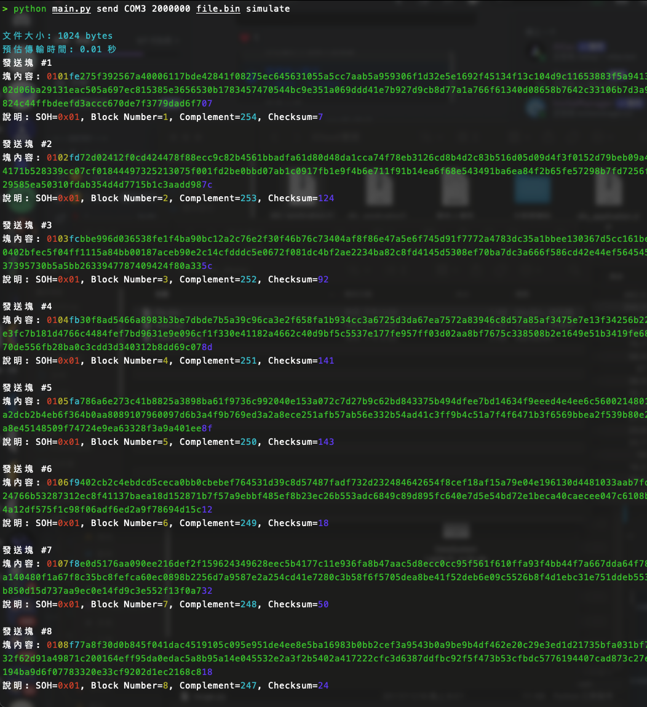
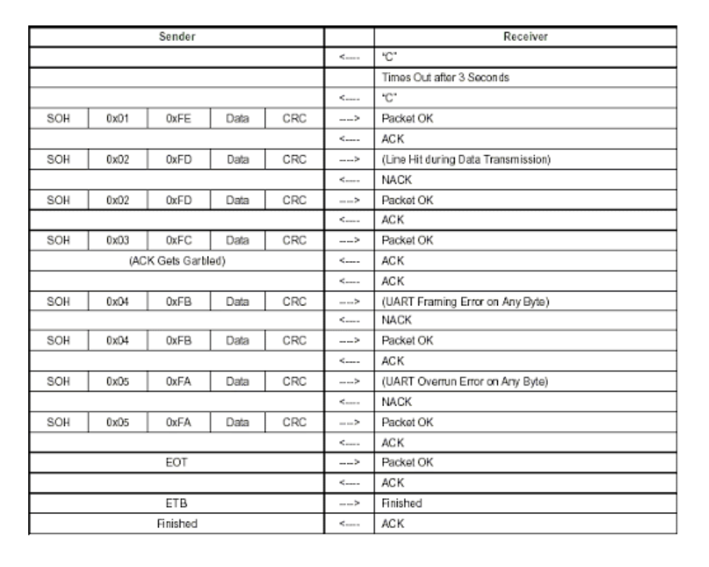
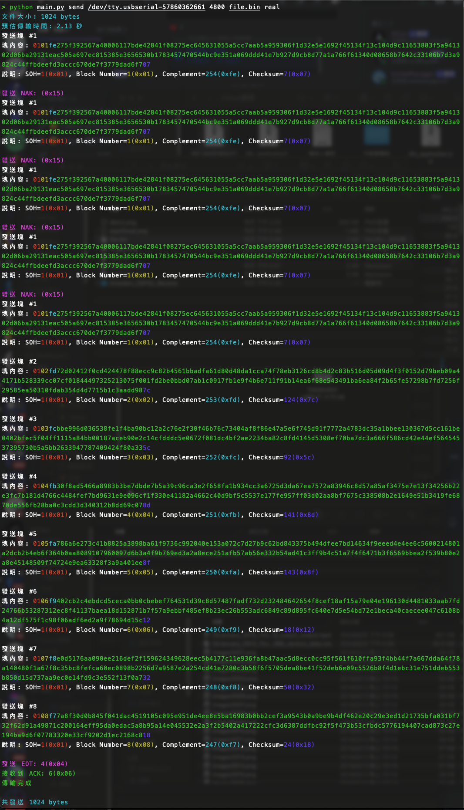

# XMODEM 傳輸工具

這是一個使用 XMODEM 協議進行文件傳輸的 Python 工具。它可以在模擬模式和實體模式下運行，並支持發送和接收文件。

## 需求

- Python 3.11（建議）
- `pyserial` 庫
- `colorama` 庫

## 安裝

首先，請確保已安裝所需的 Python 庫：

```sh
pip install pyserial colorama
```


## 使用方法
### 發送文件

要發送文件，請使用以下命令：
```
python main.py send <串行端口> <波特率> <文件名> <模擬模式>
#例如，要在模擬模式下發送文件 example.txt
python main.py send COM3 9600 example.txt simulate
```


###接收文件
例如，要在模擬模式下接收文件並保存為 received.txt，請使用以下命令：

```
python main.py receive <串行端口> <波特率> <文件名> <模擬模式>
#要在模擬模式下接收文件並保存為 received.txt，
python main.py receive COM3 9600 received.txt simulate
```


## 參數說明
<模式>: send 或 receive，指定是發送還是接收文件。
<串行端口>: 串行端口名稱，例如 COM3 或 /dev/ttyUSB0。
<波特率>: 串行通信的波特率，例如 9600。
<文件名>: 要發送或接收的文件名。
<模擬模式>: simulate 或 real，指定是否在模擬模式下運行。

## 功能
計算文件大小並顯示。
根據波特率計算預估傳輸時間並顯示。
在模擬模式下顯示發送和接收的數據塊內容，並使用不同顏色區分不同部分。


```
python main.py send COM3 2000000 file.bin simulate
```


